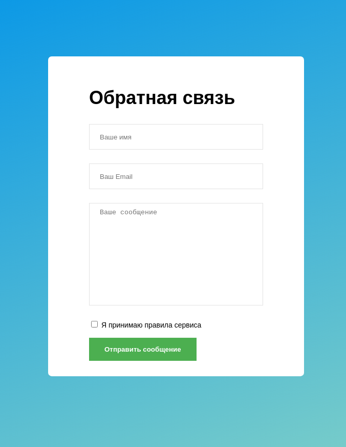

### Создайте форму обратной связи по макету ниже. Форма состоит из пяти основных элементов:

    * Два текстовых поля для ввода имени и email
    * Поле для ввода сообщения
    * Чекбокс с принятием условий сервиса
    * Кнопка отправки сообщения

Форма обратной связи
index.html

    Заголовок первого уровня внутри формы: «Обратная связь»
    Каждое текстовое поле формы лежит в обёртке с классом.form-input. Отступ снизу от каждого поля создаётся с помощью класса .mb-2. Для каждого текстового поля обязательно наличие label, который будет скрыт с помощью класса .sr-only. Его реализация уже находится в файле app.css.
    Чекбокс с принятием условий сервиса имеет обёртку с классами .small и .mb-1.

Описание полей

    Ваше имя
    Ваш Email
    Ваше сообщение
    Я принимаю правила сервиса

app.css

Реализуйте стили form-input по следующему ТЗ.

    Все дочерние элементы внутри класса form-input должны иметь блочное отображение и иметь ширину в 100%. Для выбора всех элементов используйте селектор *
    Текстовые поля имеют высоту 50 пикселей с внутренними отступами в 10 пикселей по вертикали и 20 пикселей по горизонтали. Для сохранения размеров измените поведение блочной модели с помощью свойства box-sizing со значением border-box. Поля имеют сплошную границу в 1 пиксель и цветом #e2e2e2.
    Поле для ввода сообщения имеет высоту 200 пикселей. Запретите пользователю управлять размером этого поля.

<a href='https://form_layout.surge.sh'>Demo</a>
